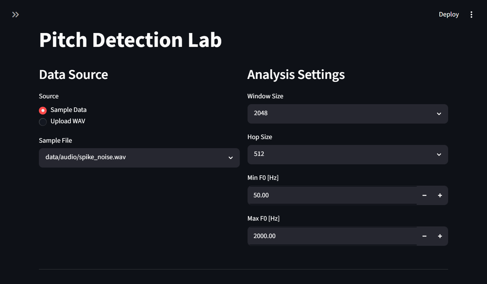
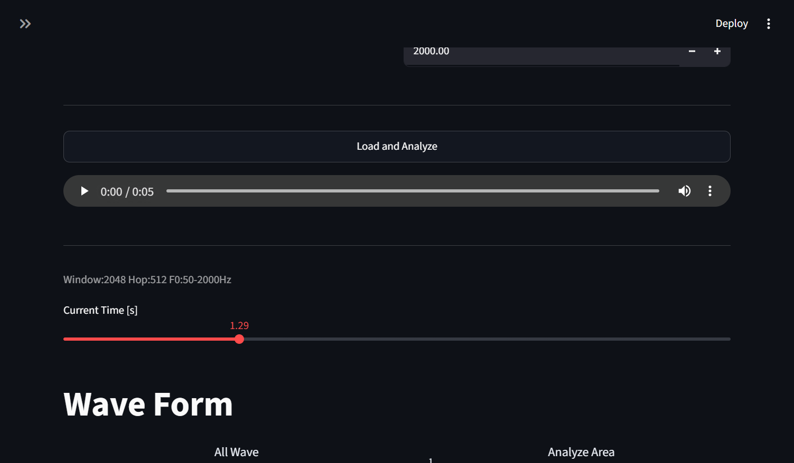
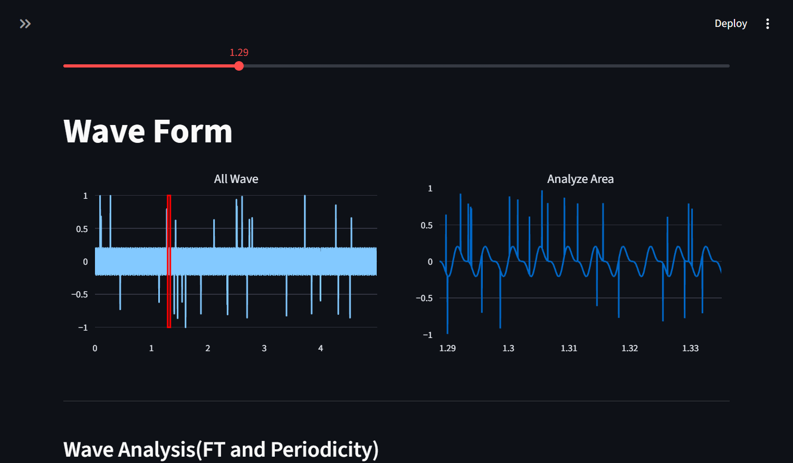
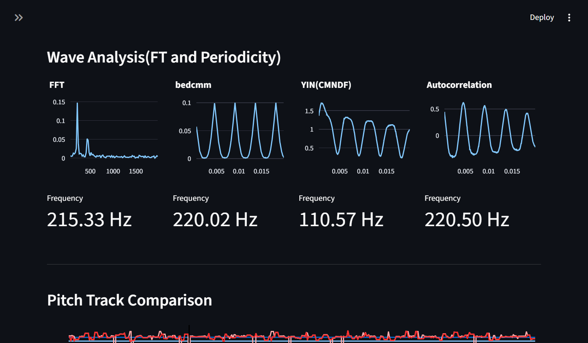
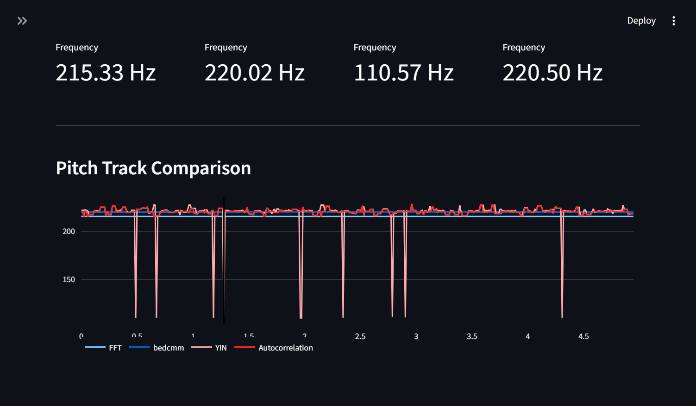
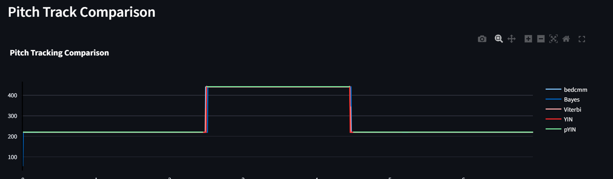
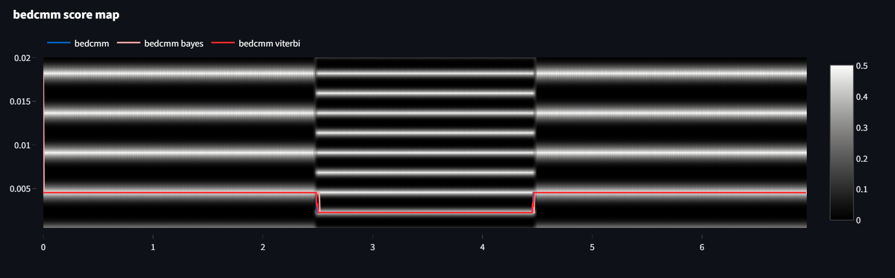
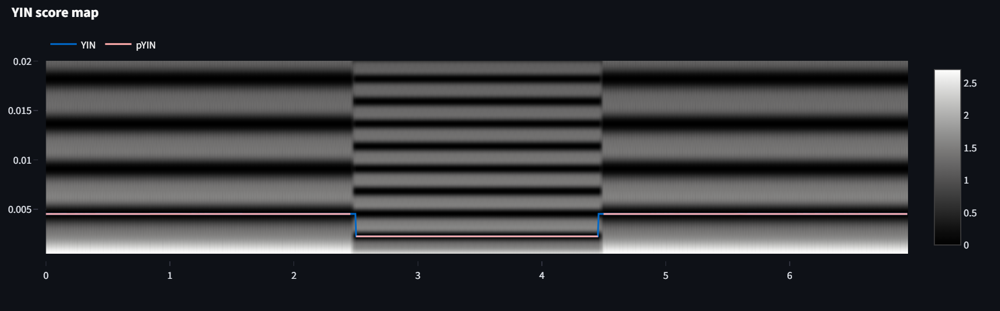
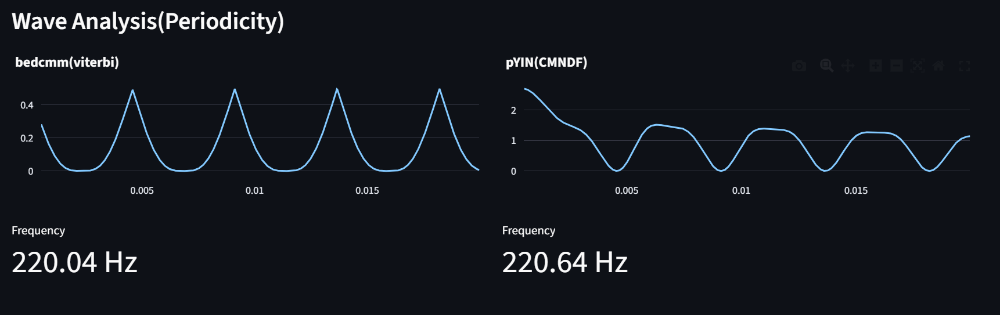

# Periodicity Analysis Lab
## Usage

```bash
uv sync
streamlit run app.py
```

## Dependencies

- NumPy
- librosa
- Plotly
- Streamlit
- bedcmmPitch (separate license)

## Pitch Detection Lab

Compare periodicity analysis methods:

- FFT
- Autocorrelation
- YIN (CMNDF)
- bedcmm

Features
- Waveform visualization
- Frame-by-frame analysis
- Pitch track comparison

### Main Interface

### Play and Control Panel

### Wave Form

## Periodicity Analysis

## Pitch Track Comparison


Comparison of FFT spectrum, autocorrelation, YIN CMNDF, and bedcmm periodicity score for the selected analysis frame.

## License

Periodicity Analysis Lab is released under the MIT License.

This project depends on the bedcmmPitch library, which is distributed under a separate proprietary/custom license.

Please refer to the bedcmmPitch repository for the terms and conditions of its use.

## Pitch Tracking Lab

Pitch Tracking Lab is an interactive Streamlit application for visualizing and comparing pitch tracking algorithms.

The application allows you to compare:

* bedcmm
* bedcmm + Bayes Tracking
* bedcmm + Viterbi Tracking
* YIN
* pYIN

### Features

* Upload audio files and analyze pitch trajectories.
* Compare pitch estimates from multiple algorithms.
* Visualize periodicity score maps as heatmaps.
* Overlay tracking results on the score maps.
* Inspect frame-by-frame periodicity functions.
* Explore how different tracking methods select pitch candidates over time.

The goal of this project is not only to compare the final pitch estimates, but also to visualize **why** each algorithm chooses a particular pitch trajectory.

### Example Views

* Pitch Tracking Comparison

* bedcmm Score Map

* YIN Score Map

* Current Frame Analysis



### Related Algorithms

* YIN
* pYIN
* Bayesian Tracking
* Viterbi Tracking
* bedcmm

### Purpose

This project aims to provide an intuitive way to understand pitch tracking algorithms by visualizing their internal score functions and tracking behavior.


## Reference
bedcmmPitch:
https://github.com/YASUHARA-Wataru/bedcmmPitch